# Workforce Forecasting and Capacity Planning Analytics

## Project Overview

Workforce planning is a critical function within customer support, business process outsourcing (BPO), shared services, and operations environments. Organizations must accurately forecast future workload demand and translate that demand into workforce requirements to ensure service levels are maintained while controlling operational costs.

This project demonstrates an end-to-end workforce forecasting and capacity planning workflow using synthetically generated operational workforce management data. The project simulates a multi-queue customer support operation and applies data analytics techniques to forecast future demand, estimate staffing requirements, evaluate workforce planning scenarios, and identify operational risks.

The project was designed as a Data Analytics portfolio project and focuses on analytical decision-making rather than data engineering or application development.

---

## Business Problem

Operational leaders must answer several critical workforce planning questions:

* How much workload is expected in the future?
* How many employees will be required to support forecasted demand?
* How does shrinkage impact staffing requirements?
* What happens if staffing levels increase or decrease?
* Which periods of the year represent the greatest operational risk?

This project addresses these questions through a structured workforce planning workflow consisting of demand forecasting, capacity planning, and scenario modeling.

---

## Project Objectives

The primary objectives of this project were to:

* Simulate realistic operational workforce management data
* Analyze historical workload patterns
* Forecast future workload demand
* Convert forecasted demand into workforce requirements
* Quantify the impact of shrinkage on staffing needs
* Evaluate alternative workforce planning scenarios
* Identify operational risks and workforce shortages
* Generate actionable workforce planning recommendations

---

## Project Architecture

---

## Dataset Overview

The project uses synthetically generated workforce management data covering the period:

**January 2024 – December 2025**

The generated data simulates a customer support operation consisting of five queues:

* Customer Service
* Billing
* Claims
* Technical Support
* Escalations

Generated datasets include:

### Workload Data

* Daily transaction volume
* Queue-level demand
* Average Handle Time (AHT)
* Seasonality effects
* Trend effects

### Workforce Data

* Scheduled FTE
* Available FTE
* Staffing plans

### Shrinkage Data

* Leave
* Training
* Meetings
* Other unavailable time

---

# Phase 1 – Synthetic Data Generation

The first phase focused on creating realistic operational workforce data suitable for workforce planning analysis.

### Outputs

* fact_workload.csv
* staffing_plan.csv
* shrinkage.csv

### Deliverables

Generated datasets were exported to the `data/raw` directory for downstream analysis.

---

# Phase 2 – Exploratory Data Analysis

The EDA phase investigated workload trends, seasonality patterns, staffing behavior, shrinkage trends, and workforce utilization.

## Key Findings

### Workload Trends

* Workload volume increased by 3.12% from 2024 to 2025.
* Q4 produced the highest workload volumes.
* December generated the highest monthly demand.

### Queue Analysis

* Customer Service represented 36.34% of workload volume.
* Escalations represented 4.55% of workload volume.
* Customer Service and Billing accounted for the majority of operational demand.

### Seasonality

* Monday generated the highest average daily volume.
* Sunday generated the lowest average daily volume.

### Average Handle Time

* Escalations recorded the highest average handling time.
* AHT remained relatively stable throughout the week.

## Visualizations

### Daily Volume Trend

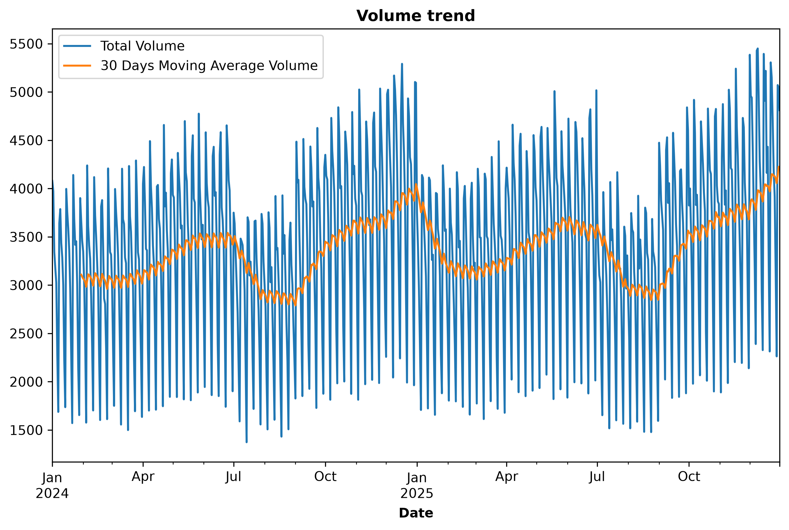

### Queue Contribution

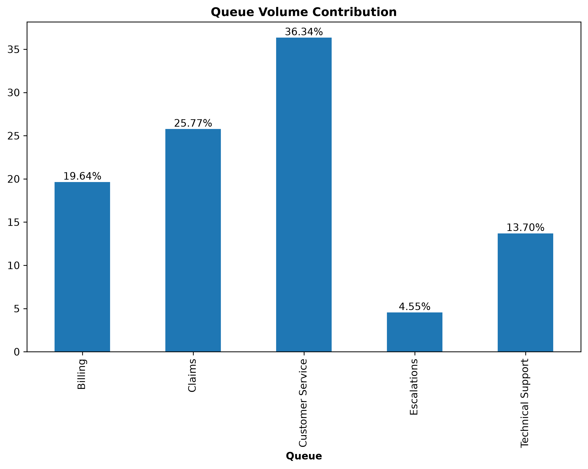

### Average Volume by Month

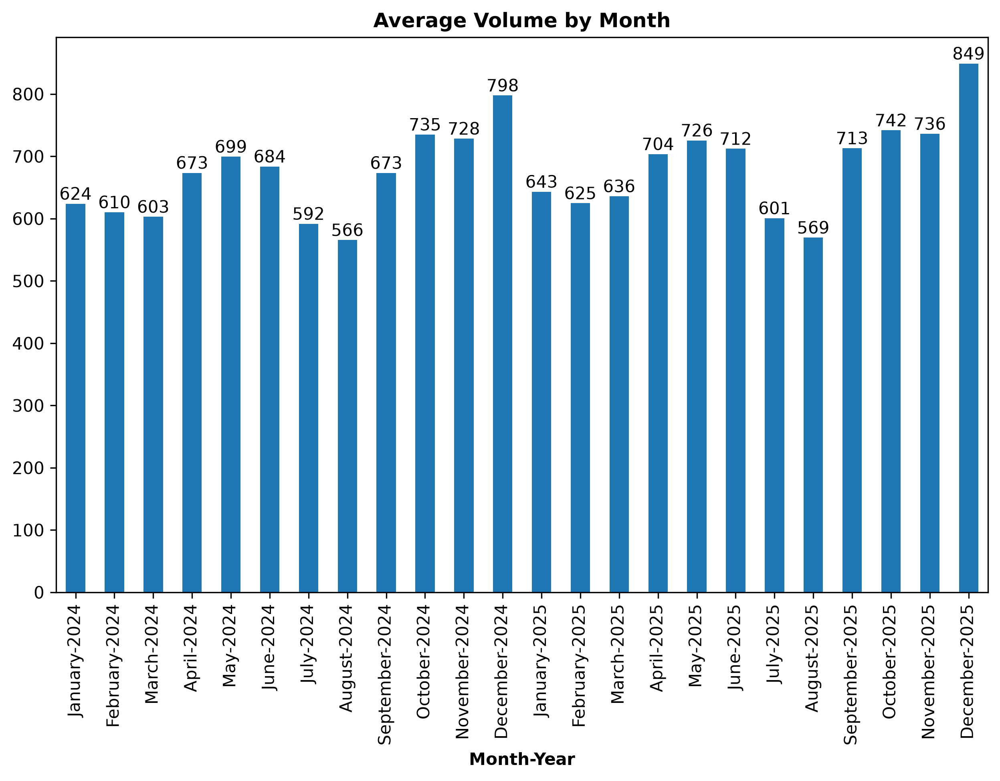

### Average Daily Volume Heatmap

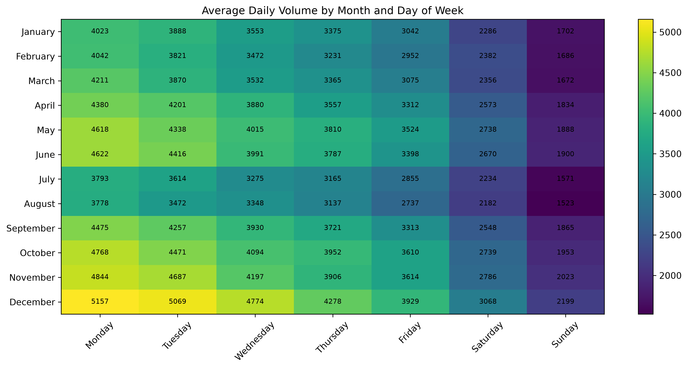

---

# Phase 3 – Forecasting

The forecasting phase evaluated multiple forecasting approaches and selected the best-performing model for production forecasting.

## Models Evaluated

### Moving Average

* 7-Day Rolling Average

### Holt-Winters Exponential Smoothing

* Multiplicative Trend
* Multiplicative Seasonality

### Linear Regression

Features:

* Day Index
* Month Indicators
* Day-of-Week Indicators

## Model Performance

| Model             | MAPE   |
| ----------------- | ------ |
| Moving Average    | 25.53% |
| Holt-Winters      | 7.20%  |
| Linear Regression | 4.97%  |

## Outcome

The Linear Regression model achieved the highest forecasting accuracy and was selected to generate workload forecasts for 2026.

## Visualizations

### Model Comparison

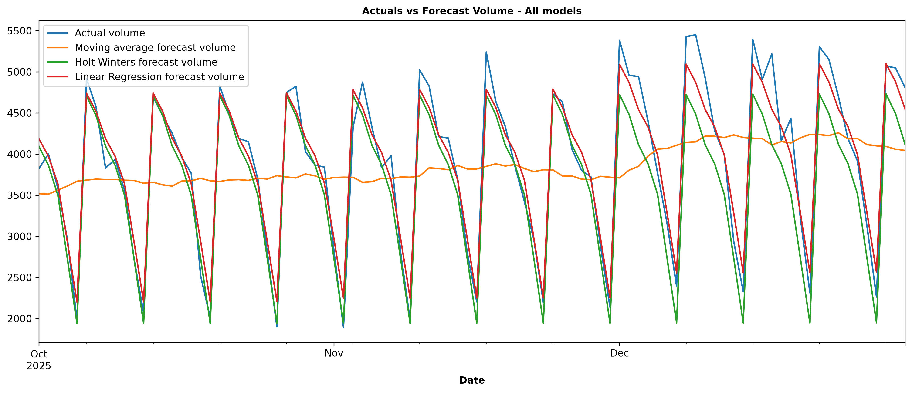

### Linear Regression Forecast

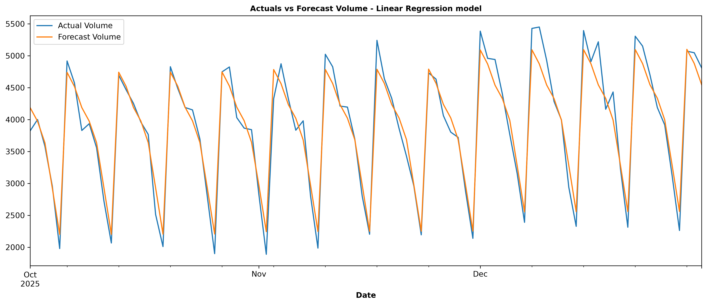

### Historical and Forecasted Demand

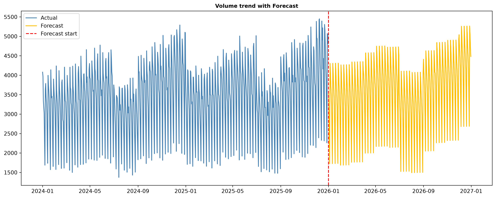

---

# Phase 4 – Capacity Planning

The capacity planning phase translated forecasted workload volumes into workforce requirements using historical AHT and shrinkage assumptions.

## Key Findings

| Metric                                 | Value    |
| -------------------------------------- | -------- |
| Average Daily Volume                   | 3,554.51 |
| Peak Daily Volume                      | 5,265.64 |
| Average Workload Hours                 | 472.87   |
| Average Raw FTE Requirement            | 59.11    |
| Average Shrinkage Adjusted Requirement | 85.16    |
| Average Additional FTE Required        | 26.05    |

### Highest Workforce Demand Months

1. December
2. November
3. June

### Lowest Workforce Demand Months

1. August
2. July
3. February

## Visualizations

### Forecasted Demand

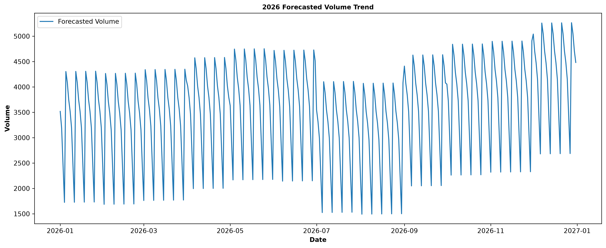

### Workforce Requirements

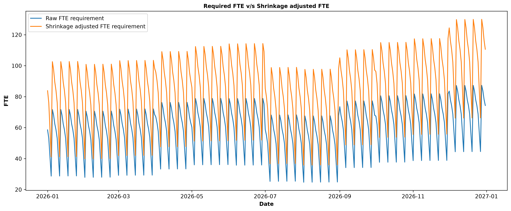

### Additional FTE Required

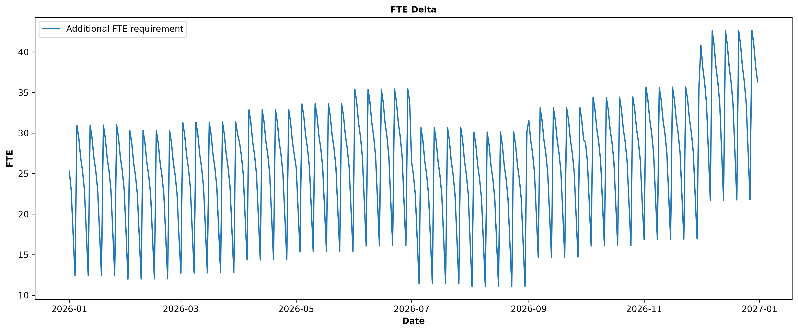

---

# Phase 5 – Workforce Scenario Modeling

The final analytical phase evaluated workforce coverage under different workforce availability assumptions.

## Scenarios Evaluated

### Attrition

15% reduction in workforce availability

### Baseline

Historical workforce availability

### Hiring

15% increase in workforce availability

## Scenario Summary

| Scenario  | Coverage % | Gap    | Critical Risk Days |
| --------- | ---------- | ------ | ------------------ |
| Attrition | 77.31%     | -24.08 | 241                |
| Baseline  | 90.96%     | -13.37 | 135                |
| Hiring    | 104.60%    | -2.66  | 32                 |

## Key Findings

* Historical staffing levels may not fully support forecasted demand.
* Workforce availability significantly influences operational risk.
* Hiring improves workforce coverage and reduces critical risk days.
* Attrition creates substantial staffing shortages.
* Workforce coverage varies throughout the year due to demand seasonality.

## Visualizations

### Coverage Comparison

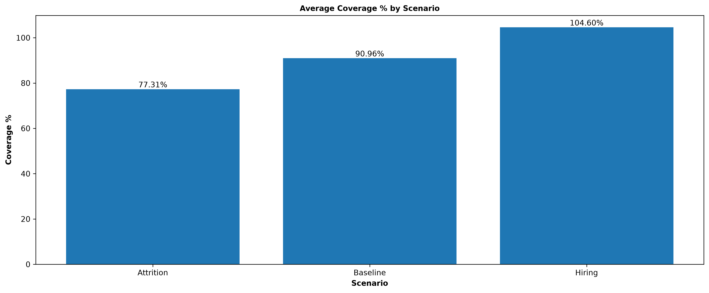

### Risk Distribution

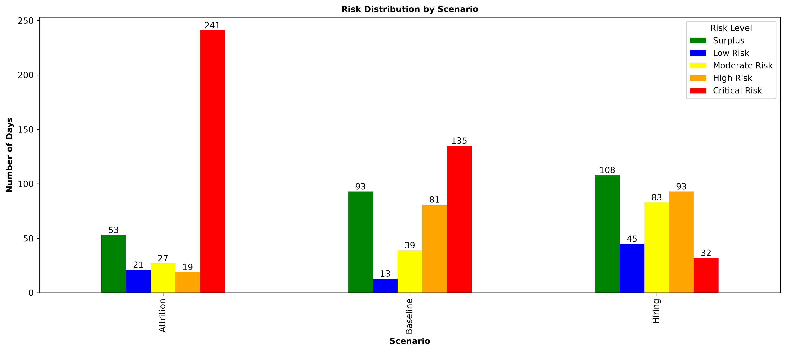

### Hiring Scenario

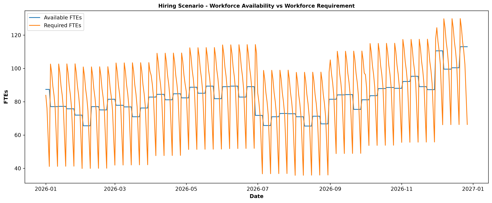

### Attrition Scenario

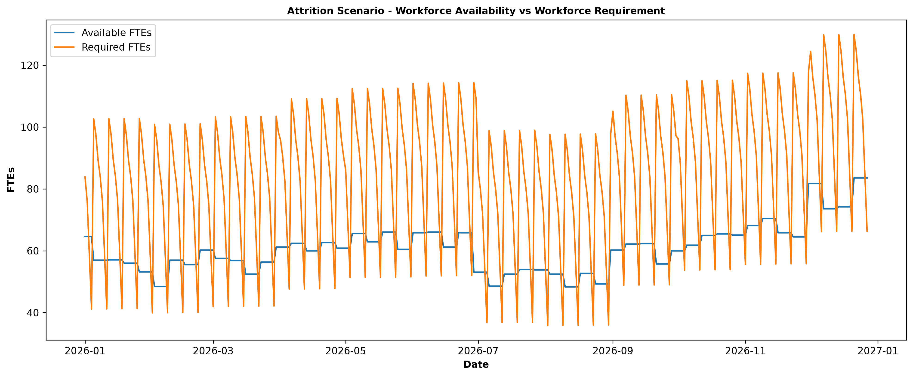

---

# Business Recommendations

## Increase Workforce Capacity

Scenario analysis demonstrated that increasing workforce availability by 15% produced the strongest operational outcomes and significantly reduced workforce risk.

## Improve Shrinkage Management

Review training schedules, meetings, and non-productive activities to improve workforce availability.

## Plan for Seasonal Peaks

Q4 and December consistently generated the highest workload volumes and workforce requirements. Seasonal workforce planning should be prioritized ahead of these periods.

## Monitor Workforce Risk Metrics

Organizations should continuously monitor:

* Staffing Gap
* Coverage Percentage
* Shrinkage
* Workforce Availability
* Forecast Accuracy

to proactively identify workforce risks.

---

# Project Limitations

This project intentionally uses synthetic data and simplified workforce planning assumptions.

Known limitations include:

* Synthetic data may not fully replicate real-world operational behavior.
* The data generator does not simulate idle time.
* Workforce utilization may exceed 100% in certain scenarios.
* Queue-level forecasting was not implemented.
* Intraday forecasting was not modeled.
* Workforce scheduling constraints were simplified.
* Attrition and hiring scenarios use fixed percentage assumptions.

---

# Future Improvements

Potential future enhancements include:

* Queue-level forecasting
* Intraday forecasting
* SLA prediction
* Monte Carlo workforce simulations
* Attrition prediction modeling
* Real-world workforce datasets
* Interactive dashboard development

---

# Technologies Used

### Programming

* Python

### Data Analysis

* Pandas

### Forecasting

* Statsmodels
* Scikit-Learn

### Visualization

* Matplotlib
* Seaborn

### Development

* Jupyter Notebook
* UV

---

# Conclusion

This project demonstrates how workforce forecasting, capacity planning, and scenario modeling can be integrated into a structured workforce planning workflow capable of supporting operational decision-making.

The analysis identified strong workload seasonality, quantified the impact of shrinkage on workforce requirements, and demonstrated how workforce availability influences operational risk. The findings showed that maintaining historical staffing levels may not be sufficient to support forecasted demand, while proactive workforce expansion significantly improves workforce coverage and reduces operational risk.

Overall, the project illustrates how data analytics techniques can be applied to workforce management challenges to support staffing decisions, evaluate alternative workforce strategies, and improve operational planning outcomes.
